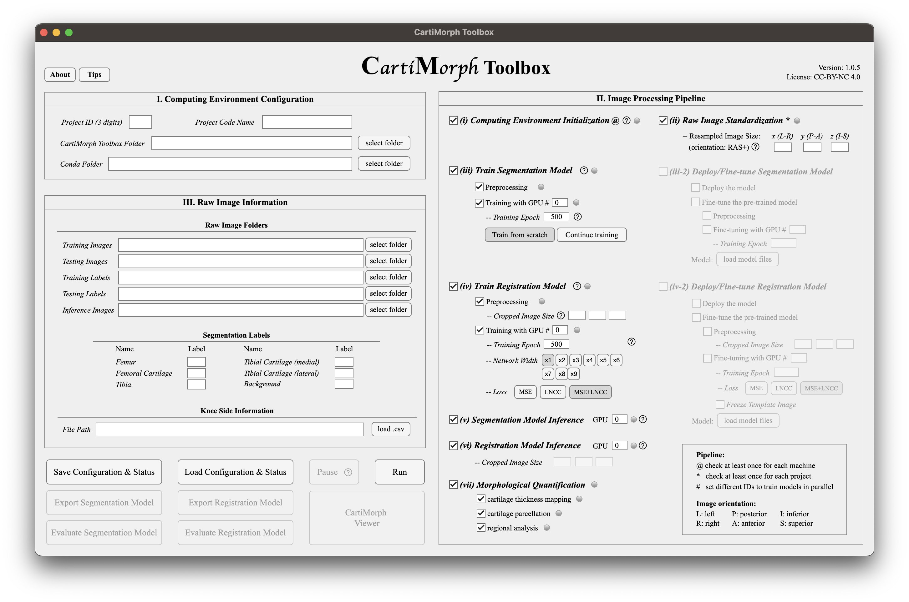

# Step-by-step Instructions

## Graphical User Interface



==Check the tips==

## Prerequisites

- Data
  - NIfTI format: `.nii` or `.nii.gz`
  - **Crutial**: the patellar cartilage in the axial view should be parallel to the image axis (see example below)
- Dependency: conda (anaconda or miniconda)
- OS: Linux


## Section I. Computing Environment Configuration

- `Project ID (3 digits)`: you must specify a unique 3-digit ID for each project/task/experiment, especially when you want ot train or finetune the segmentation model.
- `Project Code Name`: project name
- `CartiMorph Toolbox Folder`: the working directory for training data and results
- `Conda Folder`: choose one of these folders, do not go into subfolders 
  - `miniconda3` for miniconda
  - `anaconda3` for anaconda

## Section II. Image Processing Pipeline

- `(i) Computing Environment Initialization`: CMT creates conda environments with [CartiMorph-nnUNet](https://github.com/YongchengYAO/CartiMorph-nnUNet) and [CartiMorph-vxm](https://github.com/YongchengYAO/CartiMorph-vxm) installed
- `(ii) Raw Image Standardization`: define the resampled image size in RAS+ orientation
- `(iii) Train Segmentation Model`
  - `Continue training`: use the same project ID and name, you can continue previously stopped training. In this case, the epoch is total training epoch.
- `(iii-2) Deploy/Fine-tune Segmentation Model`
  - **Import Model**: press `load model files` and choose the **parent folder** of model files
- `(iv) Train Registration Model`:  
  - `Training Epoch` and `Network Width` can be increased
  - `Loss`: the default loss funciton (MSE+LNCC) is recommended
- `(iv-2) Deploy/Fine-tune Registration Model`:  
  - **Import Model**: press `load model files` and choose the **parent folder** of model files. The model properties, model weights, and the template image learned from the loaded model will be imported.
  - `Freeze Template Image`: the option would freeze the imported template, useful when the template is considered good enough and the user only wish to fine-tune the registration network.

## Section III. Raw Data Information

This is where you define training/inference data. If you did not configure the pipeline to train/finetune a model, training data is not needed.

- `Knee Side Information`: load a .csv file with NIfTI filenames and knee side for all images included in the <training>, <testing>, and <inference> set. An example of the .csv file is as follows.

  ```
  filename1.nii.gz,right
  filename1.nii.gz,left
  filename1,right
  ```

## Outputs in the`Results` Folder

CartiMorph Toolbox saves the quantification results into the `Results` folder with 1 subfolder for each project.  Folders are organized as follows.

```python
# [Results] folder from CartiMorph Toolbox
# ├── [CartiMorph Toolbox folder]
#  ├── Results
#   ├── Task<ID>_<task-name> // <--- "Result Folder" for CMV
#	   ├── [case-name]
#	    ├── CartilageSubregion
#			├── CartilageSubregion_Figure // figure files
#			├── Image
#			├── MorphologicalQuantification // quantificaiton files
#			 ├── [case-name]_MorphQuant.csv // csv files
#			├── Surface
#			├── Surface_Figure // figure files
#			├── SurfaceNormal
#			├── SurfaceNormal_Figure // figure files
#			├── ThicknessMap
#			├── ThicknessMap_Figure // figure files
#			├── ThicknessMap
```

## Data visualization

- Launch the CartiMorph Viewer from the CMT UI, or
- Use the standalone [CartiMorph Viewer](https://github.com/YongchengYAO/CartiMorph-Viewer) 

[<<< Back to the main document](https://github.com/YongchengYAO/CartiMorph-Toolbox)
