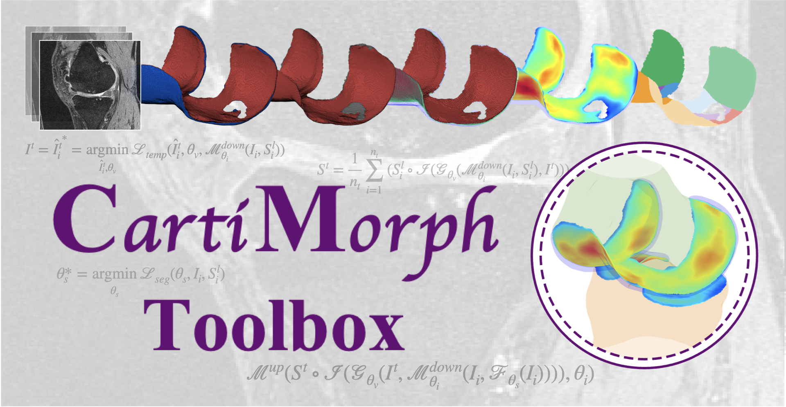

:fire: SOURCE CODE RELEASE :fire:

**Stay tuned: watch (upper right corner) > custom > Releases**

<br/><br/>

## Features of CartiMorph Toolbox (CMT)

- [**CartiMorph**](https://github.com/YongchengYAO/CartiMorph): a framework for knee articular cartilage morphometrics
- DL Models:
  - **CMT-reg**: a joint template learning and registration model
  - Segmentation: nnUNet
- User-friendly: 
  - automatic configuration
  - automatic image preprocessing 
  - pause and resume running
  - models import and export functions make fine-tuning and deployment easy
- Deep learning models training, evaluation, and inference
- Transfer learning (fine-tuning)
- Knee articular cartilage morphometrics
  - full-thickness cartilage loss (FCL)
  - cartilage thickness map
  - cartilage surface area
  - cartilage volume
  - regional analysis (20 subregions)
- Data visualization with [CartiMorph Viewer (CMV)](https://github.com/YongchengYAO/CartiMorph-Viewer) 

<br/><br/>

## Toolbox Release

Release version convention: v[major].[minor].[patch]

Check the [CMT release log](https://github.com/YongchengYAO/CartiMorph-Toolbox/blob/main/Documents/CMT_releases.md) for details.  |  [Latest Release: v1.0.5](https://github.com/YongchengYAO/CartiMorph-Toolbox/releases/tag/v1.0.5)

- CartiMorph Toolbox installer: install the complete set of tools for computing and visualization
- CartiMorph Viewer installer: install the standalone visualization UI

<br/><br/>

## Model Checkpoint Release:

Check the [model releases log file](https://github.com/YongchengYAO/CartiMorph-Toolbox/blob/main/Models/model_releases.md) for details. Just download the archived file, extract the files, and select the folder when importing models in CMT.

<br/><br/>

## Example Data & Results

- Test CartiMorph Toolbox with our [example data](https://github.com/YongchengYAO/CartiMorph-Toolbox/tree/main/Examples-Data)
- Test CartiMorph Viewer with our [example results](https://github.com/YongchengYAO/CartiMorph-Toolbox/tree/main/Examples-CMV) generated from the CartiMorph Toolbox

<br/><br/>

## :rocket: Processed Data: OAIZIB-CM

**This is the data used for training CMT-reg and nnUNet in CMT**

| Source       | link                                                         |
| ------------ | ------------------------------------------------------------ |
| Google Drive | [here](https://drive.google.com/drive/folders/13_afAKSH7ZMOI_Nk2gfoihbJKwafw1l9?usp=share_link) |
| Huggingface  | [here](https://huggingface.co/datasets/YongchengYAO/OAIZIB-CM/tree/main) |

If you use our preprocessed data, please note that the manual segmentation annotations come from this work: 

- Automated Segmentation of Knee Bone and Cartilage combining Statistical Shape Knowledge and Convolutional Neural Networks: Data from the Osteoarthritis Initiative (https://doi.org/10.1016/j.media.2018.11.009)

<br/><br/>

## 🛠️ Installation

### How to install CMT/CMV on Linux?

```bash
# Install CMT on Linux
chmod u+x CartiMorphToolbox-linux-standalone-v1.0.5.install
./CartiMorphToolbox-linux-standalone-v1.0.5.install
# Install CMV on Linux
chmod u+x CartiMorphViewer-linux-standalone-v1.0.5.install
./CartiMorphViewer-linux-standalone-v1.0.5.install
```

Check the [post-installation instructions page](https://github.com/YongchengYAO/CartiMorph-Toolbox/blob/main/Documents/post_installation_linux.md) for setting environment variables and aliases, and solving library conflicts.

### How to launch CMT on Linux?

During the installation, you are asked to set the folder for CMT and Matlab Runtime. Suppose you set them to `<CMT>` and `<MR>`, use this CLI command to launch the toolbox:  

```bash
# Go the the CMT folder, replace <CMT> 
cd <CMT>/application
# Launch CMT, replace <MR>
bash run_CartiMorphToolbox.sh <MR>/R2023b
```

Tips: Setting alias for bash shell: adding a line to `.bashrc` and launch the toolbox with the CLI command `CMT`.

```bash
# Change <> to actual paths
alias CMT="bash <path/to/run_CartiMorphToolbox.sh> <path/to/matlab/runtime>"
```

### How to install CMV on macOS?

(Q: Why CMT is not available on macOS? A: Training deep learning models on macOS is not supported.)

1. Download `CartiMorphViewer-macOS-standalone-v1.0.5.install.app.zip`

2. Unzip the downloaded file by double-clicking or via command 

   ```bash
   unzip CartiMorphViewer-macOS-standalone-v1.0.5.install.app.zip
   ```

3. :fire: Since macOS adds a `com.apple.quarantine` attribute to files downloaded from the internet, marking them as untrusted, we can remove the attribute via 

   ```bash
   sudo xattr -rd com.apple.quarantine CartiMorphViewer-macOS-standalone-v1.0.5.install.app
   ```

4. Now you can double click to install CMV on macOS.

<br/><br/>

## Contribution & Related Work

CMT is based on previous works on medical image segmentation and registration. Specifically, we made minor modificaiton to the nnUNet (v1) and major changes to VoxelMorph. The training losses and strategy of our registration model is different from the original VoxelMorph model. Our modified packages are published as [CartiMorph-vxm](https://github.com/YongchengYAO/CartiMorph-vxm#cartimorph-vxm) and [CartiMorph-nnUNet](https://github.com/YongchengYAO/CartiMorph-nnUNet#cartimorph-nnunet).

You can find the examplary training scripts:

- 2-stage registraion and template learning: [training_vxm.sh](https://github.com/YongchengYAO/CartiMorph-Toolbox/blob/main/Scripts/regModel/training_vxm.sh)
- segmentation with nnUNet: [training_3dF.sh](https://github.com/YongchengYAO/CartiMorph-Toolbox/blob/main/Scripts/segModel/training_3dF.sh)

Note that the scripts are not intended to be used separately from the CMT as it relies on the automatic preprocessing in the toolbox, which mainly consists of image reorientation, resampling, auto-downsampling (for registration model), and central cropping (for registration model).

<br/><br/>

## Step-by-step Instruction

For detailed instructions, please go to [this page](https://github.com/YongchengYAO/CartiMorph-Toolbox/blob/main/Documents/instructions.md).

<br/><br/>

## Debug

Once the preprocessing steps in the segmentation model and registration model training sections are completed, you should be able to observe computing on GPU with the `nvidia-smi` command. One way to monitor the process is by `watch -n1 nvidia-smi`.

When training models on custom data, there is a risk that errors or problems with the data could adversely impact the training process. As we are not using any kind of container, package dependency error may occur and cause failure in deep learning model training and inference. Please open issues to help us improve.

For detailed instructions on how to debug, go to [this page](https://github.com/YongchengYAO/CartiMorph-Toolbox/blob/main/Documents/debug.md).

<br/><br/>

## Known Issues

For some identified issues, go to [this page](https://github.com/YongchengYAO/CartiMorph-Toolbox/blob/main/Documents/knownIssues.md).

<br/><br/>

## Applications

- [**Quantifying Knee Cartilage Shape and Lesion: From Image to Metrics**](https://github.com/YongchengYAO/CMT-AMAI24paper)

<br/><br/>

## Citation

If you use the toolkit, please cite the CartiMorph paper.

```
@article{YAO2024103035,
title = {CartiMorph: A framework for automated knee articular cartilage morphometrics},
journal = {Medical Image Analysis},
author = {Yongcheng Yao and Junru Zhong and Liping Zhang and Sheheryar Khan and Weitian Chen},
volume = {91},
pages = {103035},
year = {2024},
issn = {1361-8415},
doi = {https://doi.org/10.1016/j.media.2023.103035}
}
```
```
@InProceedings{10.1007/978-3-031-82007-6_16,
author="Yao, Yongcheng
and Chen, Weitian",
editor="Wu, Shandong
and Shabestari, Behrouz
and Xing, Lei",
title="Quantifying Knee Cartilage Shape and Lesion: From Image to Metrics",
booktitle="Applications of Medical Artificial Intelligence",
year="2025",
publisher="Springer Nature Switzerland",
address="Cham",
pages="162--172"
}
```
